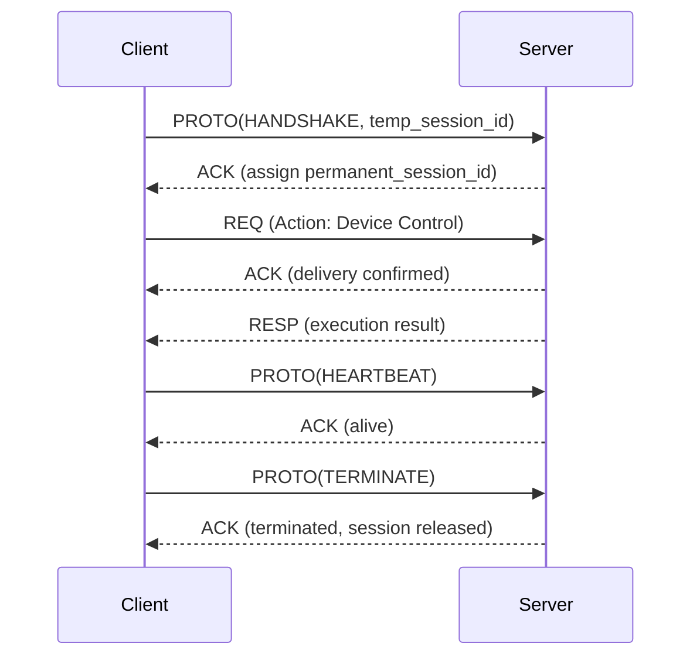
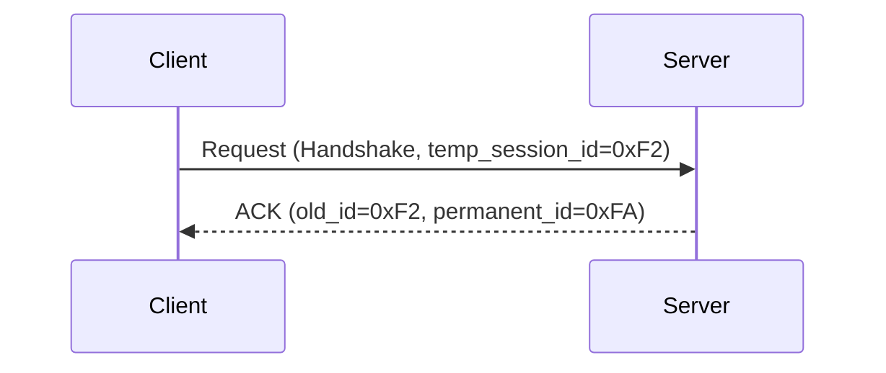
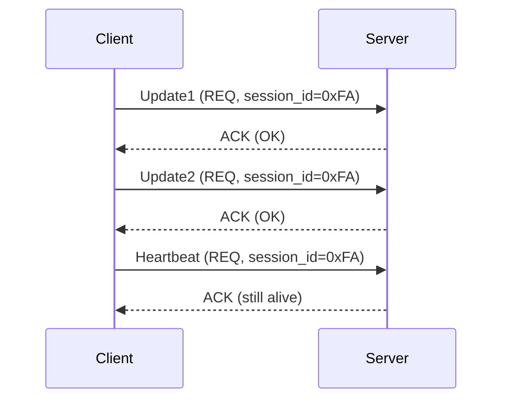
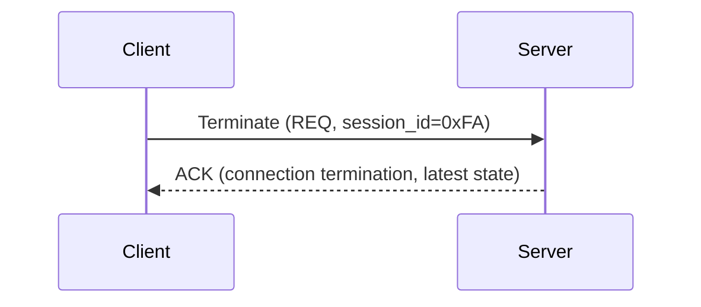

# USP – UDP Session Protocol

**USP (UDP Session Protocol)** is a lightweight, session-oriented communication protocol built on top of UDP.
It adds **sessions, acknowledgments, retries, and heartbeats** to make communication reliable while staying simpler than TCP.

---

## ✨ Features

* **Session Management**

  * Temporary → permanent session IDs via handshake.
  * Explicit session termination.
  * Session timeouts and cleanup.

* **Reliable Delivery**

  * ACK/NAK on top of UDP.
  * Retransmission on request timeout.
  * Ordered updates with request IDs.

* **Message Types**

  * **REQ** – request from client to server.
  * **ACK** – acknowledgment of a request.
  * **RESP** – response with data.
  * **PROTO** – protocol-level actions (handshake, terminate).

* **Keep-alive**

  * Heartbeat packets to check connection liveness.

---

## 📡 Message Types

USP defines **four top-level message types**:

1. **REQ** – Application requests (client → server).

  * Used for normal operations (device actions, queries, configurations).

2. **RESP** – Responses (server → client).

  * Sent when the server returns data or results.

3. **ACK** – Acknowledgments (both directions).

  * Confirms receipt of REQ or PROTO messages.
  * Prevents retransmission on client timeout.

4. **PROTO** – Protocol control requests.

  * Reserved for **internal protocol logic**, not application logic.
  * Examples:

    * `HANDSHAKE` – session initiation (temporary → permanent session ID).
    * `TERMINATE` – orderly session shutdown.
    * `HEARTBEAT` – keepalive.
    * Future extensions: `RESUME_SESSION`, `NEGOTIATE_VERSION`, etc.

---

## 📦 Message Formats

There are **four message formats** corresponding to the types above. Each message starts with a common header, 
followed by type-specific fields.
👉 This way, **REQ, RESP, and ACK** remain cleanly application-facing, while **PROTO** encapsulates everything
needed to run the protocol itself.

### REQ

| Field         | Type      | Size | Description                     |
|---------------|-----------|------|---------------------------------|
| Version       | uint8\_t  | 1 B  | Protocol version                |
| Type          | uint8\_t  | 1 B  | Always `REQ`                    |
| Session ID    | uint16\_t | 2 B  | Request Session ID (permanent)  |
| Request ID    | uint16\_t | 2 B  | Original request identifier     |
| Timestamp     | uint32\_t | 4 B  | Client timestamp                |
| Packets Count | uint8\_t  | 1 B  | Total amount of request packets |
| Packet Index  | uint8\_t  | 1 B  | Index of packet being sent      |
| Auth          | uint32\_t | 4 B  | Authentication token (optional) |
| Action Group  | uint8\_t  | 1 B  | Group (MANAGE, DEVICE, etc.)    |
| Action        | uint8\_t  | 1 B  | Specific action                 |
| Size          | uint16\_t | 2 B  | Payload length                  |
| Data          | bytes     | var  | Request payload                 |

---

### RESP

| Field         | Type      | Size | Description                     |
|---------------|-----------|------|---------------------------------|
| Version       | uint8\_t  | 1 B  | Protocol version                |
| Type          | uint8\_t  | 1 B  | Always `RESP`                   |
| Session ID    | uint16\_t | 2 B  | Request Session ID              |
| Request ID    | uint16\_t | 2 B  | Original request identifier     |
| Timestamp     | uint32\_t | 4 B  | Server timestamp                |
| Packets Count | uint8\_t  | 1 B  | Total amount of request packets |
| Packet Index  | uint8\_t  | 1 B  | Index of packet being sent      |
| Status        | uint8\_t  | 1 B  | `0x00` = OK, other = error      |
| Size          | uint16\_t | 2 B  | Payload length                  |
| Data          | bytes     | var  | Response data                   |

---

### ACK

| Field      | Type      | Size | Description                           |
|------------|-----------|------|---------------------------------------|
| Version    | uint8\_t  | 1 B  | Protocol version                      |
| Type       | uint8\_t  | 1 B  | Always `ACK`                          |
| Session ID | uint16\_t | 2 B  | Request Session ID                    |
| Request ID | uint16\_t | 2 B  | Original request identifier           |
| Timestamp  | uint32\_t | 4 B  | Sender (client/server) timestamp      |
| Status     | uint8\_t  | 1 B  | `0x00` = OK, other = error            |
| Size       | uint16\_t | 2 B  | Payload length                        |
| Data       | bytes     | var  | Optional metadata (e.g., new session) |

---

### PROTO

| Field      | Type      | Size | Description                           |
|------------|-----------|------|---------------------------------------|
| Version    | uint8\_t  | 1 B  | Protocol version                      |
| Type       | uint8\_t  | 1 B  | Always `PROTO`                        |
| Session ID | uint16\_t | 2 B  | Request Session ID                    |
| Request ID | uint16\_t | 2 B  | Original request identifier           |
| Timestamp  | uint32\_t | 4 B  | Sender (client/server) timestamp      |
| Action     | uint8\_t  | 1 B  | `HANDSHAKE`, `TERMINATE`, `HEARTBEAT` |
| Size       | uint16\_t | 2 B  | Payload length                        |
| Data       | bytes     | var  | Optional payload                      |

---

## 🔄 Protocol Lifecycle

### 0. General Flow (Overview)

### 1. Handshake

---

### 2. Session Communication

---

### 3. Termination

---

## ⏱️ Timeouts & Heartbeats

* **Request Timeout**

  * Retransmit request N times if no ACK is received.

* **Session Timeout**

  * Kill session if no packets are exchanged for T seconds.

* **Heartbeat**

  * Lightweight “garbage” request.
  * ACK confirms session is still valid.

---

## 📑 Summary

USP is a simple, UDP-based protocol that introduces:

* Session initiation and termination.
* Reliable delivery via ACK/NAK.
* Heartbeats and timeouts for liveness.
* Flexible request/response structure.

It provides **TCP-like reliability** while preserving **UDP simplicity**.
